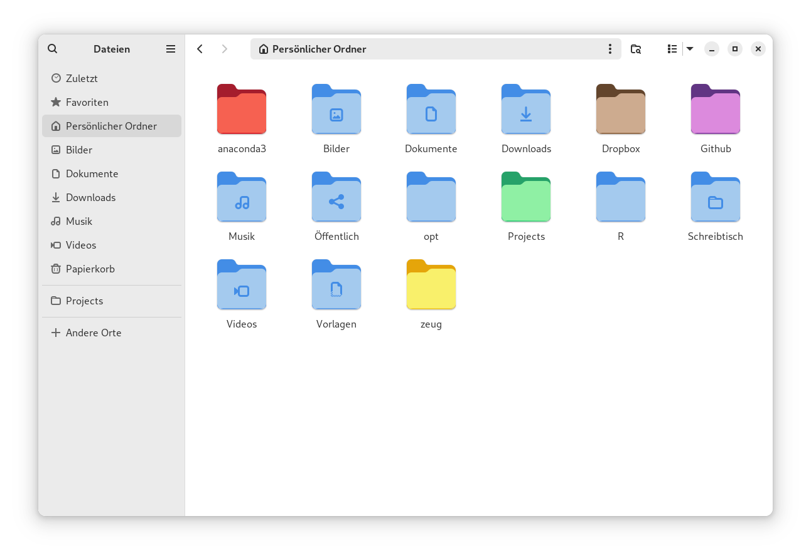

# Colored Folder Icons (Adwaita)

Folder icons in all colors of the [GNOME color palette](https://developer.gnome.org/hig/reference/palette.html) (except for white).

To change the icon of a folder, simply right click it, select Properties, click the little Edit-button on the folder icon & select the icon you want to use. To learn how to create your own icons, you can watch [this video](https://www.youtube.com/watch?v=23xsuszVOIU).
